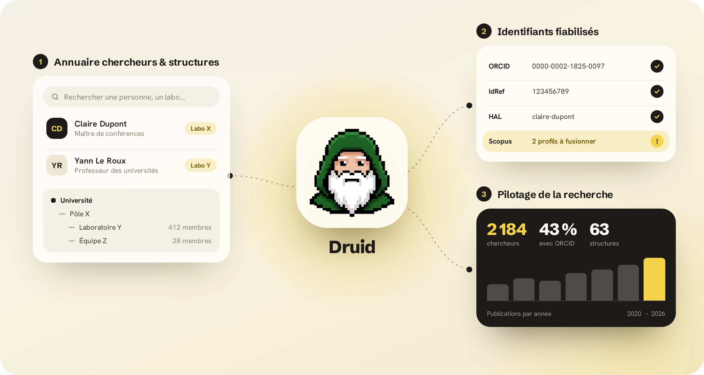

# Druid — Directory for Researchers, Units & Identifiers

<p align="center">
  
</p>

**Druid** gère l'annuaire de la recherche d'un établissement, fiabilise les identifiants des chercheurs et
sert à piloter sa production scientifique. Il est développé par Guillaume Godet, service Bibliométrie du SCD de Nantes
Université, et s'inscrit dans l'écosystème [CRISalid](https://github.com/CRISalid-esr).

- **Démo publique** (données fictives, lecture seule) : <https://druid-demo.pages.dev>
- **Centre d'aide** : <https://druid-aide.guillaumegodet.workers.dev>


---

## Fonctionnalités

### 1. Annuaire des chercheurs et des structures

- **Personnes** : fiches des personnels de recherche (emploi, appartenances aux labos et équipes, dates
  précises ou approximatives, statut Interne / Départ / Parti / Externe), avec recherche, filtres et exports
  CSV, Excel et PDF.
- **Structures** : pôles, laboratoires et équipes, avec leurs identifiants (UAI, ROR, ISNI, Wikidata) et
  leurs tutelles. Le labo de rattachement d'une personne se déduit de ses appartenances.
- **Groupes** : listes de chercheurs à la demande, qui ont chacune leur tableau de bord.
- **Synchronisation avec l'annuaire LDAP** : une revue des écarts avant toute mise à jour, par lots. Les
  statuts validés à partir d'une liste fiable passent avant le LDAP et expirent au bout de 18 mois.
- **Rubrique « À traiter »** : les doublons à fusionner et les tâches à mener hors de Druid, avec des
  e-mails prêts à copier.
- **Dataviz RH** : parité, pyramide des âges, grades, employeurs.

### 2. Identifiants fiabilisés

- **Une page unique, « Alignement des identifiants chercheurs »**, pour **IdRef**, **ORCID**, **HAL**
  (IdHAL), **OpenAlex** et **Scopus**. Elle ne liste que les fiches qui demandent une action : candidat
  à confirmer, profils à fusionner, notice IdRef remplacée.
- **Export ABES** : un classeur XLSX pour faire créer ou enrichir les notices IdRef d'un labo.
- **Export vers CRISalid** : les fichiers `people.csv` et `structures.csv` pour le *directory bridge*.

### 3. Pilotage de la recherche

Le tableau de bord bibliométrique (ECharts) s'appuie sur les exports d'un back-end qui agrège OpenAlex et
le Baromètre de la science ouverte (BSO). Ses onglets : vue d'ensemble, collaborations (nationales,
internationales, par établissement partenaire ou consortium), impact et citations, ouvrages, revues, suivi
des APC, financements, axes stratégiques, benchmark, charte de signature, équipes, doctorants, chercheurs,
réseau, liste des publications, veille et sources.

- **Veille** : les dernières publications, lues directement sur OpenAlex.
- **Intégration** : chaque graphique peut s'afficher hors authentification (`/embed`), et un lien direct
  restitue la vue complète.

### Aide et assistants

- **Centre d'aide** ([`help/`](help/), site Starlight) : guides, tutoriels et sources des données. Un bouton
  « ? » ouvre, depuis chaque écran, la page d'aide qui lui correspond. Un assistant « Aide Druid » répond aux
  questions à partir de cette documentation.
- **Assistant de recherche CRISalid** : un chat relayé vers l'agent conversationnel adossé au graphe
  CRISalid.

---

## Instances

Le même code sert plusieurs instances. Chacune se configure par variables d'environnement, et `/api/me`
expose ses capacités (LDAP, ETL, validation des statuts…) :

| Instance | Hébergement | Particularités |
|---|---|---|
| Nantes Université | Docker (`server.cjs`) | Keycloak, LDAP, ETL bibliométrique, assistant CRISalid |
| Centrale Nantes | Cloudflare Pages + Functions | derrière Cloudflare Access ; données dans un dépôt privé |
| Démo publique | Cloudflare Pages | lecture seule, document Grist de données fictives |

Les variables propres à chaque instance sont décrites dans [`instances/README.md`](instances/README.md).

## Stack technique

- **Front** : React 19 + TypeScript, Vite, Tailwind CSS, icônes Lucide ; ECharts (tableau de bord) et
  Recharts (dataviz RH).
- **Serveur** : `server.cjs` (Express), avec authentification Keycloak (OIDC), proxy Grist (la clé ne
  quitte pas le serveur), API du tableau de bord, de la veille et des chats. Sur Cloudflare, des Pages
  Functions (`functions/`) jouent ce rôle.
- **Données** : Grist (source de vérité), exports du back-end bibliométrique montés en lecture seule,
  validation par Zod.
- **Scripts** (`scripts/`) : synchronisations LDAP, IdRef, ORCID, HAL, OpenAlex et Scopus, fusion des
  doublons, export ABES.

## Développement

```bash
npm install
npm run dev          # front seul (Vite)
npm run build        # puis `node server.cjs` pour le serveur complet (auth, proxys, API)
npm test             # Vitest
```

Principales variables d'environnement (`.env`) :

- `VITE_GRIST_DOC_ID` : document Grist ; `GRIST_API_KEY` : clé Grist, **côté serveur uniquement**.
- `KEYCLOAK_URL`, `KEYCLOAK_REALM`, `KEYCLOAK_CLIENT_ID`, `APP_URL` : authentification.
- `LDAP_URL`, `LDAP_BIND_DN`, `LDAP_BIND_PASSWORD` : synchronisation LDAP (sans valeur par défaut).
- `ETL_API_URL`, `DASHBOARD_SHARED_SECRET` : back-end bibliométrique (tableau de bord, console ETL,
  groupes).
- `PIPELINES_URL`, `PIPELINES_API_KEY` : assistant de recherche CRISalid.
- `VITE_HELP_URL` : adresse du centre d'aide.
- `DRUID_ENV` : environnement affiché (`production` par défaut ; toute autre valeur, par exemple `test`,
  ajoute un bandeau en haut de l'application).

En production, l'image Docker (`Dockerfile`, `node server.cjs` sur le port 3000) est lancée par le projet
compose de l'établissement, hors de ce dépôt. Aucun réglage d'instance n'est compilé dans l'image (le
front reçoit son document Grist par `/api/me`) : la même image sert l'instance de test et la production.

**Version et santé.** `npm run build` écrit `build-info.json` (version de `package.json`, commit, date ;
script `scripts/build-info.cjs`). La version s'affiche sous le logo et dans `/api/me` (`build`). Dans
l'image Docker, le commit et la date arrivent par les arguments de build `GIT_SHA` et `BUILD_DATE`, et
sont aussi posés en labels OCI (`docker inspect`). `GET /api/health` (public, sans session) répond
`{"status":"ok"}` et sert au `HEALTHCHECK` de l'image.

### Branches, versions et mises en production

Évolutions par branche et pull request (CI obligatoire), versions numérotées SemVer, environnement de test
séparé de la production : voir [`CONTRIBUTING.md`](CONTRIBUTING.md). Les changements de chaque version sont
dans [`CHANGELOG.md`](CHANGELOG.md).

### Langues et conventions

- **Interface bilingue anglais / français**, gérée avec LinguiJS : les chaînes sources sont en anglais, les
  traductions dans `locales/fr/messages.po`. Après tout ajout de chaîne, lancer `npm run i18n:extract`, puis
  traduire.
- **Le code est en anglais** (commentaires, logs, messages d'erreur) ; `npm test` refuse un commentaire en
  français.

## Structure du dépôt

| Dossier | Contenu |
|---|---|
| `server.cjs` | serveur Express, point d'entrée du conteneur |
| `components/` | interface : personnes, structures, groupes, alignement, tableau de bord, administration |
| `lib/`, `hooks/` | services (Grist, auth, exports), règles métier (statuts, dates, validation), schémas Zod |
| `scripts/` | synchronisations, migrations et exports en ligne de commande |
| `functions/` | Cloudflare Pages Functions |
| `instances/` | données statiques des instances sans donnée personnelle (démo) |
| `help/` | centre d'aide (Starlight) |
| `locales/` | catalogues de traduction |

## Données personnelles

Ce dépôt ne contient aucune donnée personnelle. Les données de test et de démonstration sont fictives :
identifiants ORCID et IdRef à clé de contrôle volontairement fausse, adresses `example.org`.
`scripts/publication/check_public_tree.mjs` le vérifie avant chaque publication.

## Licence

Druid est distribué sous licence [CeCILL v2.1](LICENCE)

## Contact

Pour une question, un nouveau graphique ou une nouvelle source de données, ouvrir une *issue* ou contactez-moi
